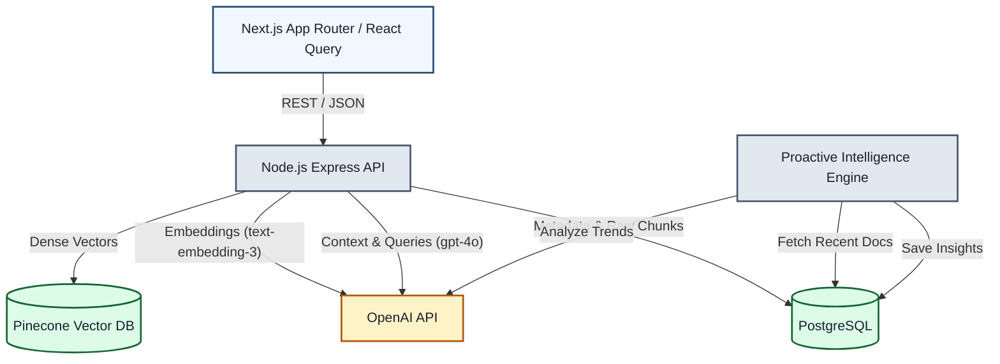

# Architecture & System Design

This document outlines the architectural decisions, data flows, and scaling strategies for the AI Knowledge Copilot. The system is designed with a "Founding Engineer" philosophy: prioritizing maintainability, modularity, and readiness for enterprise scale, while shipping a high-quality V1.

---

## 1. System Diagram

The following diagram illustrates the high-level architecture and component interactions.

---

## 2. Core Data Flows

### A. Document Ingestion Pipeline
1. **Upload:** Client uploads a file via the UI. The API accepts the file and immediately returns a `202 Accepted` status.
2. **Deduplication:** A SHA-256 hash of the file content is generated. If the hash exists in PostgreSQL, the upload is rejected to save processing power and API costs.
3. **Chunking:** The text is split using a semantic chunking algorithm with an overlap factor to ensure context isn't lost between boundaries.
4. **Embedding:** Chunks are sent to OpenAI (`text-embedding-3-small`) to generate dense vector representations.
5. **Storage:** The dense vectors are upserted into **Pinecone** (for similarity search), while the raw text chunks and metadata are saved to **PostgreSQL** (acting as the ultimate source of truth).

### B. Retrieval-Augmented Q&A
1. **Query Generation:** The user submits a question.
2. **Vectorization:** The API converts the question into a vector using OpenAI.
3. **Similarity Search:** The API queries Pinecone for the top $K$ most similar vectors.
4. **Hydration:** The API fetches the raw text corresponding to those Pinecone IDs from PostgreSQL.
5. **Synthesis:** The hydrated context and the original question are sent to OpenAI (`gpt-4o-mini`) using a strict JSON-mode system prompt to guarantee structured reasoning, citations, and confidence scores.

### C. Proactive Intelligence (Background Job)
1. **Trigger:** A scheduled `node-cron` job fires periodically.
2. **Data Fetch:** It retrieves newly processed documents from PostgreSQL.
3. **Analysis:** It prompts the LLM to act as a Data Analyst, scanning the combined context for repetitive issues, new decisions, or policy conflicts.
4. **Persistence:** Extracted insights are saved back to the PostgreSQL `insights` table.
5. **Client Polling:** The Next.js frontend, via React Query, automatically fetches these new insights for the user's Daily Briefing dashboard.

---

## 3. Scaling Approach (Path to Enterprise)

While the current architecture is robust for MVP and mid-level traffic, the following upgrades are planned for massive scale:

1. **Decoupling the Background Workers:**
   - **Current:** The ingestion pipeline and the Cron Job run on the main Node.js event loop.
   - **Next Step:** Migrate heavy processing to a dedicated worker queue (e.g., **BullMQ + Redis**). This prevents heavy file parsing or massive LLM calls from degrading API response times for standard HTTP requests.
2. **Database Connection Pooling:**
   - **Current:** Standard Drizzle ORM connections.
   - **Next Step:** Introduce **PgBouncer** to manage connection limits as horizontal API nodes scale up via Kubernetes or AWS ECS.
3. **Real-time Streaming:**
   - **Current:** The frontend polls for document status (`useQuery` refetching) and waits for complete JSON responses from the LLM.
   - **Next Step:** Implement **Server-Sent Events (SSE)** or WebSockets for real-time document processing updates and streaming token-by-token LLM responses to improve perceived latency.

---

## 4. Architectural Trade-offs

Engineering is about making informed compromises. Here are the key trade-offs made in this design:

* **Pinecone + PostgreSQL vs. Native pgvector:**
  * *Decision:* We opted for a managed vector database (Pinecone) alongside Postgres, rather than using the `pgvector` extension.
  * *Trade-off:* This introduces a two-database architecture (requiring careful sync management). However, it offloads the intense memory and CPU requirements of ANN (Approximate Nearest Neighbor) vector searches away from our relational database, ensuring our primary CRUD operations remain lightning fast.
* **Asynchronous `202 Accepted` vs. Synchronous Processing:**
  * *Decision:* The ingestion endpoint returns a success response *before* vector embeddings are finished. 
  * *Trade-off:* This requires the UI to implement polling to check if a document is "processed." However, it completely eliminates the risk of browser timeout errors when a user uploads a massive 50-page PDF that takes OpenAI 15 seconds to embed.
* **Strict JSON LLM Responses vs. Token Streaming:**
  * *Decision:* The API forces OpenAI to respond in a strict JSON format containing sources, reasoning, and the answer.
  * *Trade-off:* We lose the "typing effect" (streaming) on the frontend because we have to wait for the entire JSON object to generate before parsing it. However, the UI gains massive reliability—we can confidently build interactive React components around the data (like the Source Preview Panel) without relying on fragile regex parsing of raw text streams.
