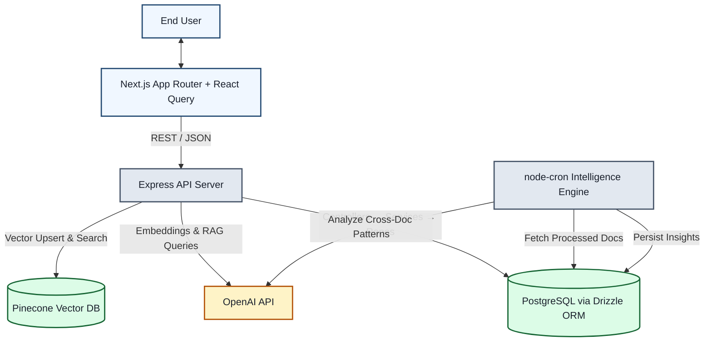

# Architecture Overview
This document serves as a critical, living template designed to equip agents with a rapid and comprehensive understanding of the codebase's architecture, enabling efficient navigation and effective contribution from day one. Update this document as the codebase evolves.

## 1. Project Structure
This section provides a high-level overview of the project's directory and file structure, categorised by architectural layer or major functional area. It is essential for quickly navigating the codebase, locating relevant files, and understanding the overall organization and separation of concerns.

```
ai-knowledge-ops/
├── backend/                        # Node.js Express API server
│   ├── src/
│   │   ├── controllers/            # HTTP request handlers (thin orchestration layer)
│   │   │   ├── ai.controller.ts    # RAG Q&A endpoint logic
│   │   │   ├── document.controller.ts  # Document & insight retrieval
│   │   │   └── ingest.controller.ts    # File upload & external source ingestion
│   │   ├── services/               # Business logic & AI integration
│   │   │   ├── ai.service.ts       # OpenAI embeddings, RAG response, proactive insights
│   │   │   └── ingest.service.ts   # Chunking, embedding pipeline orchestration
│   │   ├── repositories/           # Database access layer (Drizzle ORM queries)
│   │   │   ├── document.repo.ts    # CRUD for documents & chunks in PostgreSQL
│   │   │   ├── insight.repo.ts     # CRUD for AI-generated insights
│   │   │   └── vector.repo.ts      # Pinecone vector upsert & similarity search
│   │   ├── routes/                 # Express router definitions
│   │   │   ├── ai.routes.ts        # POST /api/ai/query
│   │   │   ├── document.routes.ts  # GET /api/docs, GET /api/docs/insights
│   │   │   └── ingest.routes.ts    # POST /api/ingest/files, POST /api/ingest/source
│   │   ├── jobs/                   # Background scheduled tasks
│   │   │   └── insight.job.ts      # node-cron proactive intelligence engine
│   │   ├── db/                     # Database configuration & schema
│   │   │   ├── index.ts            # PostgreSQL pool & Drizzle client
│   │   │   └── schema.ts           # Drizzle ORM table definitions (documents, chunks, insights)
│   │   ├── utils/                  # Shared utility functions
│   │   │   ├── chunker.ts          # Text splitting with semantic overlap
│   │   │   └── pdf-parser.ts       # PDF text extraction (pdf-parse v2)
│   │   └── server.ts               # Express app bootstrap, middleware, route registration
│   ├── drizzle.config.ts           # Drizzle Kit migration configuration
│   ├── tsconfig.json               # TypeScript compiler options (ESM)
│   ├── Dockerfile                  # Multi-stage production build
│   ├── .dockerignore               # Docker build context exclusions
│   ├── .env                        # Environment secrets (gitignored)
│   └── package.json                # Dependencies & scripts
├── frontend/                       # Next.js 16 App Router UI
│   ├── src/
│   │   ├── app/                    # Next.js App Router pages
│   │   │   ├── page.tsx            # Main KnowledgeCopilot 3-pane UI
│   │   │   ├── layout.tsx          # Root layout with QueryClientProvider
│   │   │   └── globals.css         # Tailwind v4 theme & custom utilities
│   │   ├── components/             # Reusable React components
│   │   │   └── Providers.tsx       # React Query client provider wrapper
│   │   ├── hooks/                  # Custom React Query hooks
│   │   │   └── useKnowledge.ts     # useDocuments, useUploadFile, useAskQuestion, useInsights
│   │   └── lib/                    # Frontend services & configuration
│   │       └── api.ts              # Axios instance (baseURL: localhost:5000/api)
│   ├── public/                     # Static assets (SVGs, favicon)
│   ├── next.config.ts              # Next.js configuration
│   ├── tsconfig.json               # Frontend TypeScript config
│   ├── Dockerfile                  # Multi-stage production build
│   ├── .dockerignore               # Docker build context exclusions
│   └── package.json                # Dependencies & scripts
├── docs/                           # Project documentation
│   ├── API_REFERENCE.md            # REST API endpoint documentation
│   └── DATABASE_SCHEMA.md          # PostgreSQL & Pinecone schema docs
├── infra/                          # Infrastructure configuration (mirror)
│   └── docker-compose.yml          # Docker Compose orchestration
├── docker-compose.yml              # Root-level 1-click startup orchestrator
├── .env                            # Root env for Docker Compose secrets (gitignored)
├── .gitignore                      # Git exclusion rules
├── README.md                       # Project overview & quick start guide
└── ARCHITECTURE.md                 # This document
```

## 2. High-Level System Diagram
The system follows a 3-layer backend architecture (Controllers → Services → Repositories) with a decoupled React frontend communicating via REST/JSON. A background cron engine independently generates proactive intelligence.



## 3. Core Components

### 3.1. Frontend

**Name:** AI Knowledge Copilot UI

**Description:** A responsive, 3-pane single-page application that serves as the primary user interface. Users can upload documents, search and filter the knowledge base, ask natural-language questions via a chat interface, inspect AI reasoning through a clickable Source Preview panel, and review proactive business insights via a "Daily Briefing" dashboard powered by a segmented control toggle.

**Technologies:** Next.js 16 (App Router), TypeScript, TailwindCSS v4, React Query (TanStack Query), Axios, Lucide React (icons)

**Deployment:** Docker container (`node:20-alpine`), exposed on port 3000

### 3.2. Backend Services

#### 3.2.1. Express API Server

**Name:** Knowledge Operations API

**Description:** The central REST API that handles all client requests. It follows a strict 3-layer architecture:
- **Controllers** — Thin HTTP handlers that validate input and delegate to services.
- **Services** — Business logic layer handling chunking, embedding orchestration, and LLM prompt engineering.
- **Repositories** — Pure data access functions for PostgreSQL (Drizzle ORM) and Pinecone.

Key flows include: file ingestion with SHA-256 deduplication, asynchronous embedding pipeline (fire-and-forget with `202 Accepted`), RAG-based Q&A with structured JSON responses, and document/insight retrieval.

**Technologies:** Node.js, Express 5, TypeScript (ESM), Drizzle ORM, OpenAI SDK, Pinecone SDK, Multer (memory storage), pdf-parse v2

**Deployment:** Docker container (`node:20-alpine`), exposed on port 5000. Runs `drizzle-kit push` for schema migrations on startup.

#### 3.2.2. Proactive Intelligence Engine

**Name:** Insight Cron Job

**Description:** A background scheduled task that runs daily at 2:00 AM. It fetches the 5 most recently processed documents, reconstructs their full text from stored chunks, and prompts OpenAI (`gpt-4o-mini`) to act as a Staff Data Analyst — identifying cross-document issues, decisions, and conflicts. Results are persisted to the `insights` table for frontend consumption.

**Technologies:** node-cron, OpenAI SDK, Drizzle ORM

**Deployment:** Runs in-process on the Express API server's Node.js event loop.

## 4. Data Stores

### 4.1. PostgreSQL (Relational — Source of Truth)

**Name:** Knowledge Operations Database

**Type:** PostgreSQL 15 (via Supabase in development, Dockerized `postgres:15-alpine` in production)

**Purpose:** Stores all relational metadata, raw text chunks, and AI-generated insights. Acts as the canonical source of truth that the Pinecone vector IDs reference back to.

**Key Tables:**
- `documents` — File metadata, processing status, SHA-256 content hash for deduplication
- `document_chunks` — Raw text snippets with `vectorId` linking to Pinecone, foreign-keyed to `documents`
- `insights` — AI-generated business intelligence (category, title, description, source document IDs)

### 4.2. Pinecone (Vector Database)

**Name:** Knowledge Ops Vector Index

**Type:** Pinecone (managed cloud vector database)

**Purpose:** Stores dense vector embeddings (1536-dimensional, generated by `text-embedding-3-small`) for ultra-fast Approximate Nearest Neighbor (ANN) similarity search. When a user asks a question, the query is vectorized and Pinecone returns the top-K most semantically similar chunk IDs, which are then hydrated from PostgreSQL.

**Key Index:** `knowledge-ops`

## 5. External Integrations / APIs

**OpenAI API:**
- **Purpose:** Text embedding generation (`text-embedding-3-small`) for document ingestion, and LLM reasoning (`gpt-4o-mini`) for RAG Q&A and proactive insight analysis.
- **Integration Method:** OpenAI Node.js SDK. All LLM calls use `response_format: { type: "json_object" }` to enforce structured output.

**Pinecone API:**
- **Purpose:** Vector storage and similarity search for the RAG retrieval pipeline.
- **Integration Method:** `@pinecone-database/pinecone` SDK (v7).

## 6. Deployment & Infrastructure

**Cloud Provider:** Docker-based (cloud-agnostic). Development uses Supabase-hosted PostgreSQL and Pinecone cloud.

**Key Services Used:**
- Docker & Docker Compose for full-stack orchestration
- PostgreSQL 15 (Alpine) as a containerized database
- Pinecone (managed SaaS) for vector search
- OpenAI API (managed SaaS) for embeddings and LLM

**CI/CD Pipeline:** Manual deployment via `docker-compose up --build`. GitHub repository with direct pushes to `main`.

**Monitoring & Logging:** Console-based structured logging with emoji-tagged prefixes (e.g., `🔍 [Cron Job]`, `✅ [Cron Job]`, `❌ [Cron Job]`). No external monitoring configured for V1.

## 7. Security Considerations

**Authentication:** Not implemented in V1. The system is designed for internal/trusted-network use. API keys are managed via environment variables.

**Authorization:** No RBAC or ACL layer in V1. All endpoints are publicly accessible within the network.

**Data Encryption:**
- TLS in transit (handled by Supabase and Pinecone managed services)
- API keys stored in `.env` files, excluded from version control via `.gitignore`
- SHA-256 content hashing for document deduplication (not for security, but for data integrity)

**Key Security Practices:**
- `.env` files are gitignored at both root and backend levels
- Docker Compose injects secrets via `${VAR}` interpolation from the root `.env`
- `.dockerignore` files prevent secrets from leaking into Docker build contexts

## 8. Development & Testing Environment

**Local Setup Instructions:**
1. Clone the repository
2. Copy `.env.example` to `.env` in both root and `backend/` directories
3. Run `npm install` in both `backend/` and `frontend/`
4. Start PostgreSQL (or use Supabase)
5. Run `npm run db:push` in `backend/` to sync the schema
6. Run `npm run dev` in both `backend/` and `frontend/`

**Testing Frameworks:** No automated tests configured in V1. Manual end-to-end testing via the UI and curl.

**Code Quality Tools:**
- TypeScript strict mode for type safety
- ESLint (frontend, via Next.js defaults)
- Functional programming patterns — all backend modules export `const` functions (no classes)

## 9. Future Considerations / Roadmap

- **Decouple Background Workers:** Migrate the ingestion pipeline and cron job to a BullMQ + Redis worker queue to prevent heavy LLM calls from blocking the Express event loop.
- **Database Connection Pooling:** Introduce PgBouncer for managing connection limits as API nodes scale horizontally.
- **Real-time Streaming:** Implement Server-Sent Events (SSE) or WebSockets for token-by-token LLM response streaming and real-time document processing status updates.
- **Authentication & RBAC:** Add JWT-based authentication with role-based access control for multi-tenant enterprise deployments.
- **Automated Testing:** Add Jest unit tests for services/repositories, and Playwright E2E tests for the frontend.
- **Migrate to pgvector:** Evaluate consolidating Pinecone into PostgreSQL via the `pgvector` extension to simplify the data architecture for smaller-scale deployments.

## 10. Project Identification

**Project Name:** AI Knowledge Operations System

**Repository URL:** https://github.com/engmohammed99/AI-Knowledge-Operations-System

**Primary Contact/Team:** Mohammed (Lead Developer)

**Date of Last Update:** 2026-05-03

## 11. Glossary / Acronyms

- **RAG:** Retrieval-Augmented Generation — An AI pattern that retrieves relevant context from a knowledge base before generating an LLM response, reducing hallucinations.
- **ANN:** Approximate Nearest Neighbor — A search algorithm used by vector databases to find the most similar vectors efficiently.
- **Embedding:** A dense numerical vector representation of text, generated by a language model, used for semantic similarity comparisons.
- **Chunk:** A segment of a larger document, split using an overlap algorithm to preserve semantic context across boundaries.
- **Hydration:** The process of fetching raw text data from PostgreSQL using vector IDs returned by Pinecone similarity search.
- **ORM:** Object-Relational Mapping — Drizzle ORM provides type-safe database access in TypeScript.
- **SSE:** Server-Sent Events — A web technology for real-time server-to-client data pushing over HTTP.
